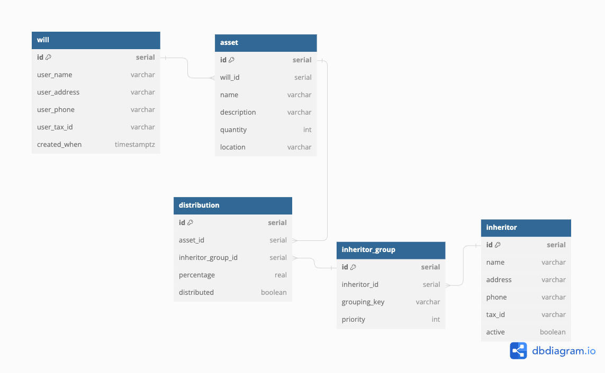

# **P4 - APP NAME**
## Developer: Arielle Gironza

[**Link to GitHub**](https://github.com/akgironza/P4-Backend)
[**Link to Deployed Site**]()
[**Link to Trello**](https://trello.com/invite/b/afFTPZvC/ATTIcb04bf921b28367ebd650746bc9e8cf4809C3687/p4-ga-seir)

### Project Description
WRITE PROJECT DESCRIPTION

### Technologies Used
HTML, CSS, SASS, Python, JavaScript, PostgreSQL, Django, ReactJS, Neon, Express.js

## List of Django Backend API Routes
|ENDPOINT|METHOD|PURPOSE|
|--------|------|-------|
|/assets|GET|Index - Show all assets|
|/assets/:id|DELETE|Destroy - Delete an asset|
|/assets/:id|PUT|Update - Update an asset|
|/assets|POST|Create - Create a new asset|
|/assets/:id|GET|Show - Show one asset|

### Entity-Relationship Diagram
